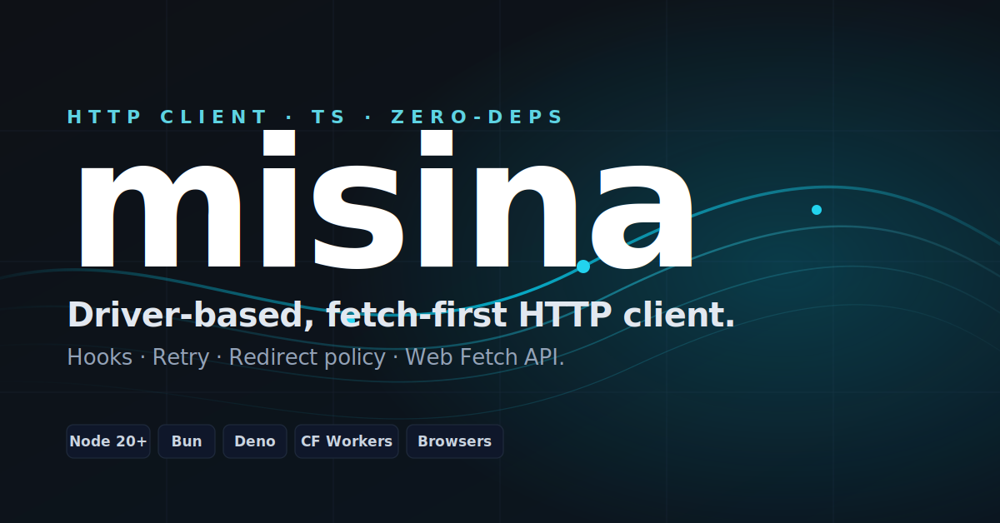

<p align="center">
  <br>
  
  <br><br>
  <b style="font-size: 2em;">misina</b>
  <br><br>
  Driver-based, zero-dependency TypeScript HTTP client.
  <br>
  Hooks lifecycle, retry with <code>Retry-After</code>, error taxonomy, redirect header policy. Pure TypeScript, works everywhere.
  <br><br>
  <a href="https://npmjs.com/package/misina"></a>
  <a href="https://npmjs.com/package/misina"></a>
  <a href="https://bundlephobia.com/result?p=misina"></a>
  <a href="https://github.com/productdevbook/misina/blob/main/LICENSE"></a>
</p>

---

## Table of Contents

- [Highlights](#highlights)
- [Install](#install)
- [Quick Start](#quick-start)
- [API](#api)
  - [createMisina](#createmisinaoptions)
  - [Hooks](#hooks)
  - [Retry](#retry)
  - [Errors](#errors)
  - [Status-Based Catchers](#status-based-catchers)
  - [validateResponse](#validateresponse)
  - [Custom JSON](#custom-json)
  - [.extend() and replaceOption](#extend-and-replaceoption)
  - [Drivers](#drivers)
- [Subpaths](#subpaths)
  - [misina/test](#misinatest)
  - [misina/auth](#misinaauth)
  - [misina/cookie](#misinacookie)
  - [misina/cache](#misinacache)
  - [misina/dedupe](#misinadedupe)
  - [misina/paginate](#misinapaginate)
  - [misina/stream](#misinastream)
  - [misina/breaker](#misinabreaker)
- [Idempotency-Key](#idempotency-key)
- [RFC 9457 problem+json](#rfc-9457-problemjson)
- [Fetch Priority](#fetch-priority)
- [Progress Events](#progress-events)
- [defer — Late-Binding Config](#defer--late-binding-config)
- [Type-Safe Path Generics](#type-safe-path-generics)
- [OpenAPI](#openapi)
- [Standard Schema Validation](#standard-schema-validation)
- [Security Defaults](#security-defaults)
- [Compared To](#compared-to)

## Highlights

- **Zero deps** in the core. Optional peers only.
- **ESM-only**, tree-shakeable, sub-path exports for everything beyond the core.
- **Driver pattern** — swap the transport. Default driver wraps `globalThis.fetch`; ship a mock or your own.
- **Hooks lifecycle** — `init`, `beforeRequest`, `beforeRetry`, `beforeRedirect`, `afterResponse`, `beforeError`. Default + per-request hooks concatenate.
- **Retry** with `Retry-After` / `RateLimit-Reset` parsing, jitter, `backoffLimit`, custom `shouldRetry`. `NetworkError` retried independently from `HTTPError`.
- **Redirect policy** — RFC 9110 §15.4 compliant. Manual follow with cross-origin auth/cookie stripping by default. `https → http` downgrade refused.
- **`validateResponse`** — sync or async predicate sees status + parsed body, lets `200 { ok: false }` count as failure.
- **Standard Schema** support for runtime validation (zod, valibot, arktype).
- **OpenAPI** — type-only adapter from `openapi-typescript` output to misina's typed API.
- **Streaming** — built-in SSE (WHATWG HTML §9.2 compliant) and NDJSON helpers.
- **HTTP cache** — RFC 9111 compliant: `Cache-Control: no-store` / `max-age`, ETag / Last-Modified revalidation, `Vary` per-variant keying.
- **Cookie jar** — RFC 6265 compliant: domain match check, Path matching, Secure flag, Max-Age / Expires.
- **394 tests** across 54 files, exhaustively covering specs and edge cases.
- **Subpath helpers**: `auth`, `breaker`, `cache`, `cookie`, `dedupe`, `paginate`, `stream`, `test`.
- **Idempotency-Key on retry** (RFC draft) — `idempotencyKey: 'auto'` sends a `crypto.randomUUID()` for retried mutations. No competitor ships this.
- **RFC 9457 problem+json** parsed onto `HTTPError.problem` automatically.
- **Circuit breaker** (`misina/breaker`) — Polly-shaped state machine, zero deps.

## Install

```sh
pnpm add misina
# or
npm install misina
# or
bun add misina
```

Requires Node ≥ 22.11 / Bun ≥ 1.2 / Deno ≥ 2.0 / Baseline 2024 browsers (Safari 17.4+, Chrome 116+, Firefox 124+). Uses native `AbortSignal.any`, `AbortSignal.timeout`, and `Headers.getSetCookie()` — no polyfills.

## Quick Start

```ts
import { createMisina } from "misina"

const api = createMisina({
  baseURL: "https://api.github.com",
  headers: { accept: "application/vnd.github+json" },
  timeout: 10_000,
  retry: 2,
})

// GET — typed
const user = await api.get<{ login: string }>("/users/octocat")
console.log(user.data.login, user.timings.total)

// POST with auto-JSON
await api.post("/repos/octocat/hello/issues", {
  title: "hi",
  body: "test",
})

// Error handling
import { isHTTPError } from "misina"
try {
  await api.get("/nope")
} catch (err) {
  if (isHTTPError(err)) console.log(err.status, err.data)
}
```

## API

### `createMisina(options?)`

```ts
import { createMisina } from "misina"

const api = createMisina({
  baseURL: "https://api.example.com", // optional
  allowAbsoluteUrls: true, // default
  headers: {
    /* ... */
  },
  timeout: 10_000, // per-attempt; false to disable
  totalTimeout: false, // wall-clock cap incl. retries
  signal: someAbortSignal, // user signal merged via AbortSignal.any
  retry: 2, // or full RetryOptions
  responseType: undefined, // 'json' | 'text' | 'arrayBuffer' | 'blob' | 'stream' | (auto)
  hooks: {
    /* ... */
  },
  driver: customDriver, // optional override (default: fetch driver)
  throwHttpErrors: true,
  validateResponse: undefined,
  parseJson: JSON.parse,
  stringifyJson: JSON.stringify,
  arrayFormat: "repeat", // 'brackets' | 'comma' | 'indices'
  paramsSerializer: undefined,
  redirect: "manual", // 'follow' | 'error'
  redirectSafeHeaders: undefined,
  redirectMaxCount: 5,
  redirectAllowDowngrade: false,
  cache: undefined, // standard fetch RequestCache
  credentials: undefined,
  next: undefined, // Next.js { revalidate, tags }
  defer: [], // late-binding callbacks
  onUploadProgress: undefined,
  onDownloadProgress: undefined,
})
```

Returns `Misina` with: `request`, `get`, `post`, `put`, `patch`, `delete`,
`head`, `options`, `extend`. All methods return a `MisinaResponsePromise<T>`.

### Hooks

```ts
const api = createMisina({
  hooks: {
    init: (options) => {
      // sync, mutates a per-request clone — runs BEFORE Request construction
      options.headers.authorization = `Bearer ${getToken()}`
    },
    beforeRequest: async (ctx) => {
      // can return a Request to replace, or a Response to skip the driver
    },
    beforeRetry: async (ctx) => {
      // ctx.error is set; refresh tokens, log, etc.
    },
    beforeRedirect: ({ request, sameOrigin }) => {
      // fired when redirect: 'manual' (default) follows a redirect
    },
    afterResponse: async (ctx) => {
      // can return a new Response to replace
    },
    beforeError: async (error, ctx) => {
      // must return an Error (transformed or original)
      return error
    },
  },
})
```

Hook errors are fatal — they don't trigger retry. Default and per-request
hooks concatenate (defaults run first).

### Retry

```ts
const api = createMisina({
  retry: {
    limit: 3,
    methods: ["GET", "PUT", "HEAD", "DELETE", "OPTIONS"],
    statusCodes: [408, 413, 429, 500, 502, 503, 504],
    afterStatusCodes: [413, 429, 503], // honor Retry-After / RateLimit-Reset
    maxRetryAfter: 60_000,
    delay: (attempt) => 0.3 * 2 ** (attempt - 1) * 1000,
    backoffLimit: 30_000,
    jitter: true,
    shouldRetry: ({ error }) => true, // ultimate escape hatch
    retryOnTimeout: true,
  },
})

// Shorthand: number → { limit }
createMisina({ retry: 5 })
// false → disabled
createMisina({ retry: false })
```

POST is **not retried** by default (idempotency).

### Errors

```ts
import {
  HTTPError,
  NetworkError,
  TimeoutError,
  isHTTPError,
  isNetworkError,
  isTimeoutError,
} from "misina"

try {
  await api.get("/x")
} catch (err) {
  if (isHTTPError(err)) {
    console.log(err.status, err.data, err.response)
  }
  if (isNetworkError(err)) console.log(err.cause)
  if (isTimeoutError(err)) console.log(err.timeout)
}
```

### Status-Based Catchers

```ts
const user = await api
  .get<User>("/users/42")
  .onError(404, () => null)
  .onError([401, 403], () => redirect("/login"))
  .onError("NetworkError", () => useCachedFallback())
```

### validateResponse

Treat `200 { ok: false }` as failure:

```ts
const api = createMisina({
  validateResponse: ({ data }) => (data as { ok: boolean }).ok === true,
})
```

Return an `Error` to throw a custom error directly.

### Custom JSON

```ts
createMisina({
  parseJson: (text) =>
    JSON.parse(text, (k, v) =>
      typeof v === "string" && /^\d{4}-\d{2}-\d{2}T/.test(v) ? new Date(v) : v,
    ),
  stringifyJson: (value) =>
    JSON.stringify(value, (_, v) => (typeof v === "bigint" ? v.toString() : v)),
})
```

### .extend() and replaceOption

```ts
import { replaceOption } from "misina"

const authed = api.extend({ headers: { authorization: "Bearer x" } })

// Replace defaults' hooks instead of concatenating
const standalone = api.extend({
  hooks: replaceOption({ beforeRequest: [myHook] }),
})

// Function form sees parent defaults
const v2 = api.extend((parent) => ({
  baseURL: parent.baseURL?.replace("/v1", "/v2"),
}))
```

### Drivers

```ts
import { createMisina, defineDriver } from "misina"
import mockDriver from "misina/driver/mock"

const driver = defineDriver(() => ({
  name: "custom",
  request: async (req) => fetch(req),
}))()

createMisina({ driver })

// Mock for tests
const mock = mockDriver({ response: new Response(JSON.stringify({ ok: 1 })) })
const test = createMisina({ driver: mock })
```

## Subpaths

Each helper lives at `misina/<name>` so you only pay for what you import.

### misina/test

```ts
import { createTestMisina } from "misina/test"

const t = createTestMisina({
  routes: {
    "GET /users/:id": ({ params }) => ({ status: 200, body: { id: params.id } }),
    "POST /users": ({ request }) => ({ status: 201, body: { ok: true } }),
    "GET /flaky": () => ({ throw: "fetch failed" }), // simulate NetworkError
    "* /slow": () => ({ delay: 200, status: 200 }),
  },
})

await t.client.get("https://api.test/users/42")
expect(t.calls).toHaveLength(1)
expect(t.lastCall().method).toBe("GET")
```

### misina/auth

```ts
import { withBearer, withBasic, withRefreshOn401, withCsrf } from "misina/auth"

const api = withBearer(createMisina({ baseURL }), () => store.token)

const refreshed = withRefreshOn401(api, {
  refresh: async () => fetchNewToken(),
})

const django = withCsrf(api, { cookieName: "csrftoken", headerName: "X-CSRFToken" })
```

`withRefreshOn401` collapses concurrent 401s into a single in-flight refresh.

### misina/cookie

```ts
import { withCookieJar, MemoryCookieJar } from "misina/cookie"

const jar = new MemoryCookieJar()
const api = withCookieJar(createMisina({ baseURL }), jar)

await api.post("/login", { user, pass }) // Set-Cookie stored
await api.get("/profile") // Cookie sent automatically
```

### misina/cache

```ts
import { withCache, memoryStore } from "misina/cache"

const api = withCache(createMisina({ baseURL }), {
  store: memoryStore({ max: 500 }),
  ttl: 60_000,
  revalidate: true, // ETag / Last-Modified → 304 → reuse
})
```

### misina/dedupe

```ts
import { withDedupe } from "misina/dedupe"

const api = withDedupe(createMisina({ baseURL }))
// Concurrent identical GETs collapse onto one network request.
```

### misina/paginate

```ts
import { paginate, paginateAll } from "misina/paginate"

// Default: follow Link rel=next
for await (const user of paginate<User>(api, "/users")) {
  console.log(user.id)
}

// Cursor-based
const all = await paginateAll<Item>(api, "/items", {
  transform: (res) => res.data.items,
  next: (res) => (res.data.next ? { query: { cursor: res.data.next } } : false),
  countLimit: 1000,
})
```

### misina/stream

```ts
import { sseStream, ndjsonStream } from "misina/stream"

const res = await api.get("/events", { responseType: "stream" })
for await (const event of sseStream(res.raw)) {
  console.log(event.event, event.data)
}

const res2 = await api.get("/feed.ndjson", { responseType: "stream" })
for await (const item of ndjsonStream<Item>(res2.raw)) {
  console.log(item)
}
```

### misina/breaker

Polly / cockatiel-shaped circuit breaker. State machine:

```
closed ──[N failures within windowMs]──▶ open
open   ──[wait halfOpenAfter]──▶ half-open  (one probe allowed)
half-open ──[probe ok]──▶ closed
half-open ──[probe fails]──▶ open  (fresh timer)
```

```ts
import { withCircuitBreaker, CircuitOpenError } from "misina/breaker"

const api = withCircuitBreaker(misina, {
  failureThreshold: 5, // trip after 5 failures
  windowMs: 30_000, // sliding window
  halfOpenAfter: 10_000, // ms before letting one probe through
  // isFailure defaults to: any thrown error or 5xx HTTPError.
  // 4xx is intentionally NOT counted (client mistake, not service degradation).
})

try {
  await api.get("/users/42")
} catch (err) {
  if (err instanceof CircuitOpenError) {
    console.log("upstream cooked — retry in", err.retryAfter, "ms")
  }
}

// Inspect / control the breaker:
api.breaker.state() // 'closed' | 'open' | 'half-open'
api.breaker.trip() // force open (e.g. external monitoring signal)
api.breaker.reset() // force closed
```

No major fetch client (ofetch, ky, axios, got, wretch) ships a built-in
breaker — users had to wrap with `cockatiel`/`opossum`. This subpath fits
naturally with misina's driver pattern and adds zero deps.

## Idempotency-Key

Auto-generate `Idempotency-Key` on retried mutations so the server can
deduplicate. Per [draft-ietf-httpapi-idempotency-key-header](https://datatracker.ietf.org/doc/draft-ietf-httpapi-idempotency-key-header/).

```ts
const api = createMisina({
  idempotencyKey: "auto", // crypto.randomUUID() per logical call
  retry: { limit: 3, methods: ["POST"] },
})

await api.post("/charges", { amount: 100 })
// First attempt → Idempotency-Key: 9b1d…
// All retries → same key. Server safely deduplicates the side-effect.
```

`'auto'` only fires for non-idempotent methods (POST/PATCH/DELETE) when
`retry > 0`. GET/HEAD/OPTIONS/PUT skip it (already idempotent by spec).
A user-supplied `Idempotency-Key` header always wins.

```ts
// String form — useful for an externally-supplied id (Stripe-style):
createMisina({ idempotencyKey: requestId })

// Function form — runs once per logical request, not per attempt:
createMisina({ idempotencyKey: (req) => `order-${orderId}` })

// Disabled (default):
createMisina({ idempotencyKey: false })
```

No competing client ships this today.

## RFC 9457 problem+json

Servers signal application errors with `Content-Type: application/problem+json`
([RFC 9457](https://www.rfc-editor.org/rfc/rfc9457.html), formerly RFC 7807).
Misina lifts the structured shape onto `HTTPError.problem` automatically.

```ts
try {
  await api.post("/charge", { amount: 100 })
} catch (err) {
  if (isHTTPError(err) && err.problem) {
    console.log(err.problem.type) // URI ref to the problem type
    console.log(err.problem.title) // short summary
    console.log(err.problem.status) // echoed status
    console.log(err.problem.detail) // specific occurrence
    console.log(err.problem.instance) // URI ref to this occurrence
    console.log(err.problem.balance) // extension fields preserved
  }
}
```

The default `error.message` includes `problem.detail` (or title fallback)
so console output is immediately useful:

```
HTTPError: Request failed with status 402: Your account balance is $0.00.
```

## Fetch Priority

Pass-through for [`RequestInit.priority`](https://web.dev/articles/fetch-priority)
— hint to the browser/runtime about the urgency of a request.

```ts
await api.get("/critical", { priority: "high" })
await api.get("/prefetch", { priority: "low" })
```

Honored by Chromium browsers, Firefox 132+, Safari 17.4+, and Cloudflare
Workers — completes the Baseline 2024 set.

## Progress Events

```ts
await api.post("/upload", file, {
  onUploadProgress: ({ percent, bytesPerSecond }) => updateBar(percent),
})

await api.get("/download/big.bin", {
  responseType: "blob",
  onDownloadProgress: ({ loaded, total }) => updateBar(loaded / (total ?? 1)),
})
```

Upload progress streams the body in 64 KB chunks via `duplex: 'half'` on
runtimes that support it (Node 22+, Bun, Deno, Chrome 105+). Safari and
Firefox don't support streaming request bodies yet — on those, the
callback is silently skipped and the body is sent in one go.

## defer — Late-Binding Config

```ts
const api = createMisina({
  defer: () => ({
    headers: { authorization: `Bearer ${currentToken()}` },
    next: { revalidate: 0 },
  }),
})
```

`defer` callbacks fire **after** init hooks, **before** beforeRequest hooks.

## Type-Safe Path Generics

```ts
import { createMisinaTyped } from "misina"

type Api = {
  "GET /users/:id": { params: { id: string }; response: User }
  "POST /users": { body: NewUser; response: User }
  "GET /users": { query: { page?: number }; response: User[] }
}

const api = createMisinaTyped<Api>({ baseURL: "https://api.example.com" })

const user = await api.get("/users/:id", { params: { id: "42" } })
//          ^? MisinaResponsePromise<User>
const created = await api.post("/users", { body: { name: "x" } })
const list = await api.get("/users", { query: { page: 2 } })
```

Path params are substituted at runtime: `/users/:id` → `/users/42` (also `{id}` syntax).

## OpenAPI

If you already run [`openapi-typescript`](https://github.com/openapi-ts/openapi-typescript) on your spec, the type-only `misina/openapi` subpath turns its output into an `EndpointsMap` for free:

```ts
import { createMisinaTyped } from "misina"
import type { OpenApiEndpoints } from "misina/openapi"
import type { paths } from "./generated.d.ts"

const api = createMisinaTyped<OpenApiEndpoints<paths>>({ baseURL })

const user = await api.get("/users/{id}", { params: { id: "42" } })
//          ^? whatever paths['/users/{id}']['get']['responses']['200'] resolves to
```

For each path × verb in your spec, the adapter produces a `${VERB} ${path}` key with the right `params`, `query`, `body`, and `response` shapes pulled from `parameters.path`, `parameters.query`, `requestBody.content['application/json']`, and `responses[200|201|204|default].content['application/json']`. Operations that don't declare path/query/body simply omit those fields.

Zero runtime cost — the published `misina/openapi/index.mjs` is **11 bytes** (re-exports only). All the work happens in `.d.mts`.

## Standard Schema Validation

```ts
import { validated, validateSchema } from "misina"
import { z } from "zod"

const UserSchema = z.object({ id: z.string(), name: z.string() })

const user = await validated(api.get("/users/42"), UserSchema)
//                                                      ^? validated against zod
```

Throws `SchemaValidationError` with `.issues` on mismatch.

## Security Defaults

- Redirect mode `'manual'` by default — misina follows redirects itself.
- Cross-origin redirects strip `Authorization`, `Cookie`, `Proxy-Authorization`, `WWW-Authenticate`. Allowlist via `redirectSafeHeaders`.
- `https → http` redirects refused unless `redirectAllowDowngrade: true`.
- Header values containing CR/LF/NUL throw — request smuggling guard.

## Compared To

- **`ofetch`** — same shape, richer hooks, retry granularity (`Retry-After`, jitter), `NetworkError`-vs-`HTTPError` distinction, redirect security policy.
- **`ky`** — closest aesthetic neighbor. Adds driver pattern, cross-runtime cookie jar, pagination, status catchers, dedupe.
- **`axios`** — Fetch-first, ESM-only, no XHR fallback in core, no CommonJS dual-build pain. No interceptor mutation surprises.
- **`got`** — got is Node-only; misina runs everywhere. Pagination + cookie jar borrow got's design without the Node dependency tax.
- **`wretch`** — flat options object instead of chainable builder, but `.onError(404, ...)` borrows wretch's catcher ergonomics.
- **None of the above** ship `idempotencyKey: 'auto'`, RFC 9457 problem+json parsing, or a built-in circuit breaker.

## Credits

misina stands on the shoulders of the modern fetch ecosystem. The design
borrows liberally from prior art — credit where it's due:

- **[ofetch](https://github.com/unjs/ofetch)** (unjs) — defer pattern, hook surface shape.
- **[ky](https://github.com/sindresorhus/ky)** (Sindre Sorhus) — `.extend()` ergonomics, `beforeRetry` returning a `Response`, response timeout semantics, `parseJson(text, ctx)` (PR #849).
- **[axios](https://github.com/axios/axios)** — request/response interceptor concept; `paramsSerializer` and the option-bag API surface.
- **[got](https://github.com/sindresorhus/got)** — pagination iterator design, cookie-jar interface contract.
- **[wretch](https://github.com/elbywan/wretch)** — `.onError(404, fn)` status catcher ergonomics.
- **[openapi-fetch / openapi-typescript](https://openapi-ts.dev/)** (drwpow) — the `Paths` shape that the `misina/openapi` adapter targets.
- **[cockatiel](https://github.com/connor4312/cockatiel)** (connor4312) and **Microsoft Polly** — circuit-breaker state-machine shape used in `misina/breaker`.
- **[Standard Schema](https://standardschema.dev)** (zod / valibot / arktype authors) — the `~standard.validate` contract.
- **[unstorage](https://github.com/unjs/unstorage)** and **[unemail](https://github.com/productdevbook/unemail)** — the `defineDriver()` pattern.

Specs and standards consulted along the way:

- **WHATWG Fetch** + **AbortSignal** + **HTML §9.2 (EventStream)**
- **RFC 9110** (HTTP semantics, redirects)
- **RFC 9111** (HTTP caching)
- **RFC 8288** (Link header)
- **RFC 6265** (Cookies)
- **RFC 9457** (Problem details for HTTP APIs)
- **draft-ietf-httpapi-idempotency-key-header**

Built by **[productdevbook](https://github.com/productdevbook)** and
**[Claude Code](https://claude.com/claude-code)** — 44 audit passes, 394
regression tests, zero deps.

## License

MIT © [productdevbook](https://github.com/productdevbook)
